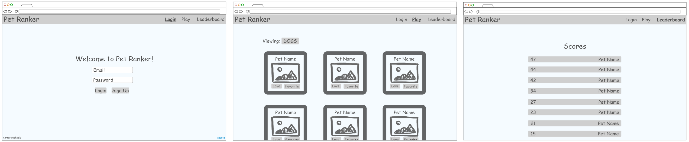
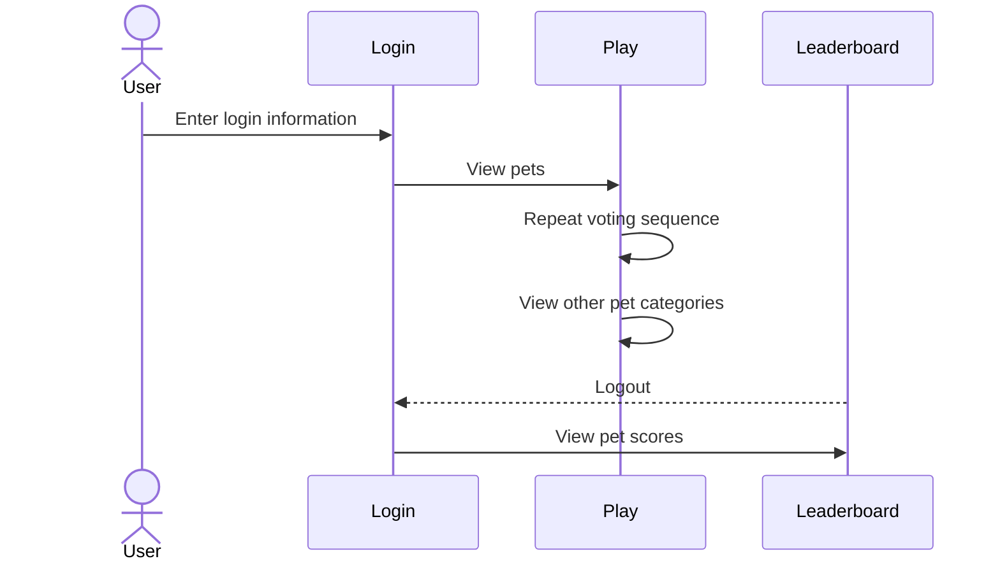

# Pet Ranker!

[My Notes](notes.md)

Pet Ranker is a website that allows users to view and vote on a list of different pets. Each day you'll have a few votes and can check the leaderboard to see which one is the favorite.

## 🚀 Specification Deliverable

For this deliverable I did the following. I checked the box `[x]` and added a description for things I completed.

- [x] Proper use of Markdown
- [x] A concise and compelling elevator pitch
- [x] Description of key features
- [x] Description of how you will use each technology
- [x] One or more rough sketches of your application. Images must be embedded in this file using Markdown image references.

### Elevator pitch

People love their pets. But when it comes to deciding who's pet is the cutest, we can't agree. Pet Ranker will be a multi-user web application that allows peers to view and vote on many different pets, with a scoreboard for some friendly competition to show which one is the most "loved". Choose your favorites and vote for them each day!

### Design

### Key features

- Sign up with email, register, login/logout
- Use you daily votes on different pets like dogs, cats, fish, and more
- Add your personal favorites to your list
- View weekly scoreboard of all the pets
- Receive notifications if one of your favorites is doing well

### Technologies

I am going to use the required technologies in the following ways.

- **HTML** - I'll have three pages for: register/login, play (with options to filter by pet type), and leaderboard
- **CSS** - A pleasing and "friendly" color scheme with matching font, effects for when you hover over and click buttons like "love" and "favorite"
- **React** - Updates the UI dynamically, like switching between logged-in and logged-out views or updating parts when votes are cast
- **Service** - Use a pet-related API (like Petfinder?) to *fetch* pet images/profiles
- **DB/Login** - Saves user data (email, password, and favorites), restricts voting to signed-in users
- **WebSocket** - Sends and receives updates to the scoreboard in real time

## 🚀 AWS deliverable

For this deliverable I did the following. I checked the box `[x]` and added a description for things I completed.

- [x] **Server deployed and accessible with custom domain name** - [My server link](https://petranker.click).

## 🚀 HTML deliverable

For this deliverable I did the following. I checked the box `[x]` and added a description for things I completed.

- [x] **HTML pages** - I created three separate pages- index.html, play.html, and leaderboard.html- to structure the app's functionality
- [x] **Proper HTML element usage** - I used HTML elements like \<header>, \<nav>, \<main>, \<footer>, \<form>, and \<table> appropriately throughout the pages
- [x] **Links** - Each page includes navigational \<a> tags linking to the other pages, allowing smooth transitions between Login, Play, and Leaderboard
- [x] **Text** - All pages contain clear headings, labels, and descriptions using \<h1>, \<h2>, \
, and \<label> elements to guide the user
- [x] **3rd party API placeholder** -I included image elements in play.html marked as placeholders for 3rd party API content
- [x] **Images** - : The play.html page displays pet images using the \ tag, simulating what will eventually be dynamic content
- [x] **Login placeholder** - index.html includes a form with email and password inputs to serve as a placeholder for the login
- [x] **DB data placeholder** - The leaderboard.html page shows a static table of scores that are placeholders for future database content
- [x] **WebSocket placeholder** - In play.html, there is a \<ul> list labeled in comments as WebSocket data placeholders, simulating real-time notifications

## 🚀 CSS deliverable

For this deliverable I did the following. I checked the box `[x]` and added a description for things I completed.

- [ ] **Header, footer, and main content body** - I did not complete this part of the deliverable.
- [ ] **Navigation elements** - I did not complete this part of the deliverable.
- [ ] **Responsive to window resizing** - I did not complete this part of the deliverable.
- [ ] **Application elements** - I did not complete this part of the deliverable.
- [ ] **Application text content** - I did not complete this part of the deliverable.
- [ ] **Application images** - I did not complete this part of the deliverable.

## 🚀 React part 1: Routing deliverable

For this deliverable I did the following. I checked the box `[x]` and added a description for things I completed.

- [ ] **Bundled using Vite** - I did not complete this part of the deliverable.
- [ ] **Components** - I did not complete this part of the deliverable.
- [ ] **Router** - I did not complete this part of the deliverable.

## 🚀 React part 2: Reactivity deliverable

For this deliverable I did the following. I checked the box `[x]` and added a description for things I completed.

- [ ] **All functionality implemented or mocked out** - I did not complete this part of the deliverable.
- [ ] **Hooks** - I did not complete this part of the deliverable.

## 🚀 Service deliverable

For this deliverable I did the following. I checked the box `[x]` and added a description for things I completed.

- [ ] **Node.js/Express HTTP service** - I did not complete this part of the deliverable.
- [ ] **Static middleware for frontend** - I did not complete this part of the deliverable.
- [ ] **Calls to third party endpoints** - I did not complete this part of the deliverable.
- [ ] **Backend service endpoints** - I did not complete this part of the deliverable.
- [ ] **Frontend calls service endpoints** - I did not complete this part of the deliverable.
- [ ] **Supports registration, login, logout, and restricted endpoint** - I did not complete this part of the deliverable.

## 🚀 DB deliverable

For this deliverable I did the following. I checked the box `[x]` and added a description for things I completed.

- [ ] **Stores data in MongoDB** - I did not complete this part of the deliverable.
- [ ] **Stores credentials in MongoDB** - I did not complete this part of the deliverable.

## 🚀 WebSocket deliverable

For this deliverable I did the following. I checked the box `[x]` and added a description for things I completed.

- [ ] **Backend listens for WebSocket connection** - I did not complete this part of the deliverable.
- [ ] **Frontend makes WebSocket connection** - I did not complete this part of the deliverable.
- [ ] **Data sent over WebSocket connection** - I did not complete this part of the deliverable.
- [ ] **WebSocket data displayed** - I did not complete this part of the deliverable.
- [ ] **Application is fully functional** - I did not complete this part of the deliverable.
